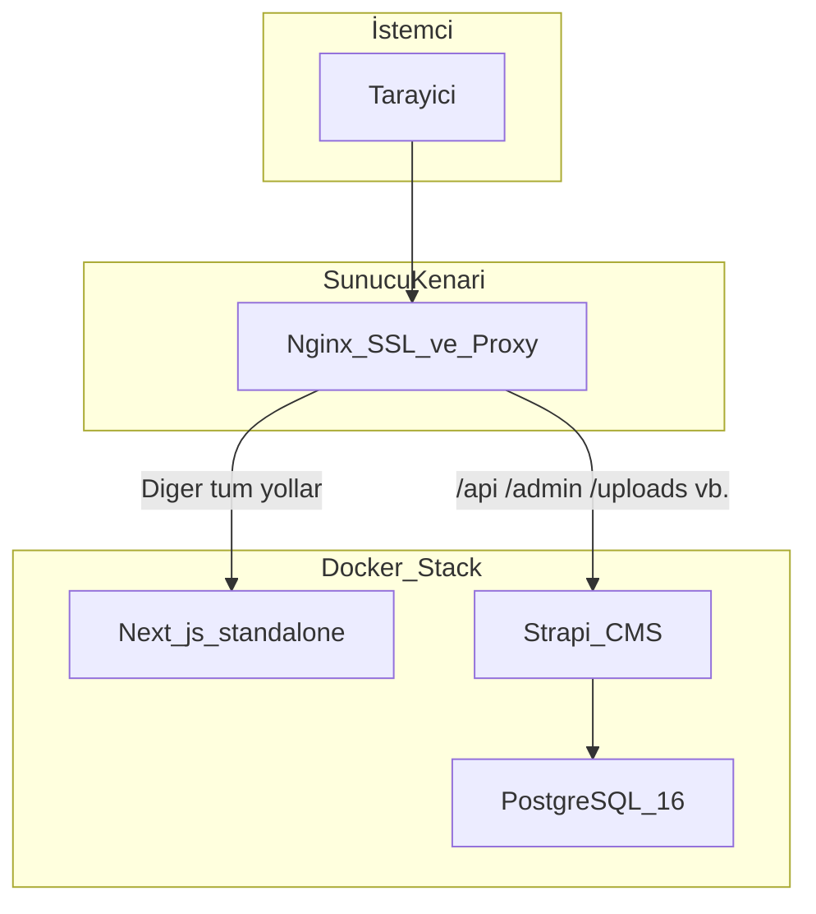

# Mimari ve teknolojiler

Bu belge, **Gülmetay-Site** monoreposunun genel mimarisini, kullanılan teknolojileri ve bileşenler arası ilişkiyi özetler. Uygulama mantığının ayrıntıları için [BACKEND.md](BACKEND.md) ve [FRONTEND.md](FRONTEND.md) dosyalarına bakın. Sunucuya dağıtım ve Nginx yönlendirmeleri için [DEPLOYMENT.md](../DEPLOYMENT.md) kullanılır.

---

## İçindekiler

1. [Genel bakış](#genel-bakış)
2. [Sistem mimarisi](#sistem-mimarisi)
3. [Repo dizin yapısı](#repo-dizin-yapısı)
4. [Teknoloji yığını](#teknoloji-yığını)
5. [Docker Compose servisleri](#docker-compose-servisleri)
6. [Ortam değişkenleri özeti](#ortam-değişkenleri-özeti)
7. [İlgili belgeler](#i̇lgili-belgeler)

---

## Genel bakış

Proje, **headless CMS** yaklaşımıyla iki ana parçadan oluşur:

| Parça | Konum | Rol |
|--------|--------|-----|
| **Backend** | `backend/` | [Strapi](https://strapi.io/) 5: REST API, yönetim paneli, medya ve içerik modelleri |
| **Frontend** | `frontend/` | [Next.js](https://nextjs.org/) 16: kurumsal site arayüzü, Strapi API ile veri alışverişi |

Üretim ortamında veritabanı **PostgreSQL** (Docker), geliştirmede yapılandırmaya göre **SQLite** da kullanılabilir. Dış dünyaya açılım genelde sunucudaki **Nginx** ile SSL ve ters vekil (reverse proxy) üzerinden yapılır; ayrıntılar [DEPLOYMENT.md](../DEPLOYMENT.md) içindedir.

---

## Sistem mimarisi

**Akış özeti:**

1. Kullanıcı HTTPS ile Nginx’e bağlanır.
2. Yol `/api/*`, `/admin/*`, `/uploads/*` ve Strapi’ye ait diğer önekler ise istek **Strapi** konteynerine (varsayılan `1337`) yönlendirilir.
3. Aksi halde istek **Next.js** konteynerine (varsayılan `3000`) gider.
4. Strapi, PostgreSQL ile konuşur; yüklenen dosyalar kalıcı volume üzerinde tutulabilir.

Nginx konfigürasyon örnekleri ve tam yol tablosu: [DEPLOYMENT.md](../DEPLOYMENT.md), proje içi örnek: `nginx/nginx.conf`.

---

## Repo dizin yapısı

| Yol | Açıklama |
|-----|----------|
| `backend/` | Strapi uygulaması (`config/`, `src/api/`, Dockerfile) |
| `frontend/` | Next.js uygulaması (`app/`, `components/`, Dockerfile) |
| `docker-compose.yml` | PostgreSQL, backend, frontend orkestrasyonu |
| `.env.production` | Dağıtımda backend ve gizli anahtarlar için şablon (git’e girmez; [.gitignore](../.gitignore)) |
| `nginx/` | Yerel/senaryo Nginx yapılandırma örnekleri |
| `DEPLOYMENT.md` | Docker ve Nginx dağıtım rehberi |
| `docs/` | Bu teknik dokümantasyon seti |

---

## Teknoloji yığını

### Çalışma ortamı ve dil

- **Node.js**: Backend `package.json` içinde `>=20.0.0 <=24.x.x` aralığı.
- **TypeScript**: Backend ve frontend derleme/tip kontrolü (`tsconfig.json`).

### Backend (`backend/package.json`)

| Teknoloji | Sürüm (yaklaşık) | Not |
|-----------|------------------|-----|
| `@strapi/strapi` | 5.31.x | Çekirdek CMS |
| `@strapi/plugin-users-permissions` | 5.31.x | Kimlik ve rol tabanlı API erişimi |
| `@strapi/plugin-cloud` | 5.31.x | Strapi Cloud ile entegrasyon seçenekleri |
| `pg` | ^8.x | PostgreSQL sürücüsü |
| `better-sqlite3` | 12.x | Yerel geliştirmede SQLite istemcisi |
| `react` / `react-dom` | ^18 | Strapi Admin arayüzü için |

### Frontend (`frontend/package.json`)

| Teknoloji | Sürüm (yaklaşık) | Not |
|-----------|------------------|-----|
| `next` | 16.0.x | App Router, `output: "standalone"` ile konteyner üretimi |
| `react` / `react-dom` | 19.2.x | UI |
| `tailwindcss` | ^4 | `app/globals.css` içinde `@import "tailwindcss"` |
| `eslint` + `eslint-config-next` | 9 / 16 | Lint |

### Güvenlik ve doğrulama

- **Cloudflare Turnstile**: İletişim formunda bot koruması; site anahtarı frontend’de, gizli anahtar Strapi’de doğrulama için kullanılır. Ayrıntı: [BACKEND.md](BACKEND.md) ve [FRONTEND.md](FRONTEND.md).

### Konteynerleştirme

- **Docker**: `backend/Dockerfile` ve `frontend/Dockerfile` çok aşamalı (multi-stage) üretim imajları.
- **docker-compose.yml**: `postgres`, `backend`, `frontend` servisleri; ağlar ve volume’lar tanımlı.

---

## Docker Compose servisleri

Kaynak: [docker-compose.yml](../docker-compose.yml).

| Servis | İmaj / bağlam | Amaç |
|--------|----------------|------|
| `postgres` | `postgres:16-alpine` | Strapi için ilişkisel veritabanı; healthcheck ile backend’in hazır olmasını bekleme |
| `backend` | `./backend` Dockerfile | Strapi; `env_file: .env.production`, `DATABASE_HOST=postgres`, uploads volume |
| `frontend` | `./frontend` Dockerfile | Next.js; build arg olarak `NEXT_PUBLIC_STRAPI_URL`, `NEXT_PUBLIC_TURNSTILE_SITE_KEY` |

**Ağlar:**

- `gulmetay-internal`: Backend ↔ PostgreSQL (ve compose içi iletişim).
- `nginx_internal`: Harici Nginx ile konteynerlerin aynı bridge üzerinde konuşması (`external: true`).

**Volume’lar:**

- `postgres-data`: PostgreSQL verisi.
- `strapi-uploads`: Strapi `public/uploads` kalıcılığı.

---

## Ortam değişkenleri özeti

Gizli değerler burada verilmez; yalnızca isim ve rol tablodur.

### Frontend (build / çalışma)

| Değişken | Zorunluluk | Açıklama |
|----------|------------|----------|
| `NEXT_PUBLIC_STRAPI_URL` | Üretimde kritik | Tarayıcının konuşacağı Strapi taban URL’i (ör. `https://alanadiniz.com` veya doğrudan Strapi origin’i) |
| `NEXT_PUBLIC_TURNSTILE_SITE_KEY` | İletişim formu | Turnstile widget için herkese açık site anahtarı |
| `NODE_ENV` | Ortam | `production` / `development` |

Docker build sırasında `NEXT_PUBLIC_*` değerleri imaja gömülür; değiştirmek için yeniden build gerekir.

### Backend (Strapi)

| Değişken | Açıklama |
|----------|----------|
| `HOST`, `PORT` | Dinleme adresi (örn. `0.0.0.0`, `1337`) — bkz. `backend/config/server.ts` |
| `APP_KEYS` ve Strapi güvenlik tuzları | Oturum ve şifreleme — bkz. `backend/.env.example` |
| `DATABASE_CLIENT` | `postgres`, `mysql` veya `sqlite` — bkz. `backend/config/database.ts` |
| `DATABASE_HOST`, `DATABASE_PORT`, `DATABASE_NAME`, `DATABASE_USERNAME`, `DATABASE_PASSWORD` | PostgreSQL bağlantısı |
| `DATABASE_URL` | Opsiyonel; tanımlıysa bağlantı dizesi kullanımı |
| `TURNSTILE_SECRET_KEY` | Turnstile sunucu doğrulaması (iletişim `create`) |
| `TURNSTILE_VERIFY_URL` | Opsiyonel; varsayılan Cloudflare `siteverify` uç noktası |

Örnek isimler: [backend/.env.example](../backend/.env.example), dağıtım notları: [.env.production](../.env.production) (yerel doldurma; repoda gizli içerik yok).

---

## İlgili belgeler

| Belge | İçerik |
|-------|--------|
| [BACKEND.md](BACKEND.md) | Strapi içerik tipleri, REST API, iletişim denetleyicisi, medya |
| [FRONTEND.md](FRONTEND.md) | Next.js sayfaları, `fetch` kalıpları, Turnstile istemcisi |
| [DEPLOYMENT.md](../DEPLOYMENT.md) | Nginx kuralları, ağ isimleri, adım adım deploy |
